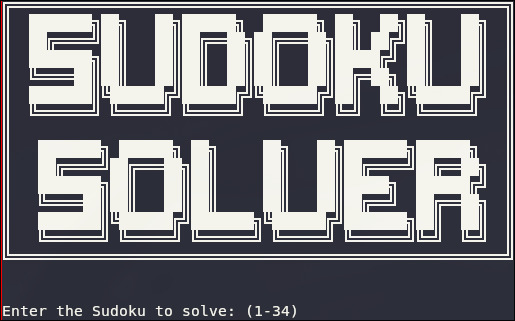
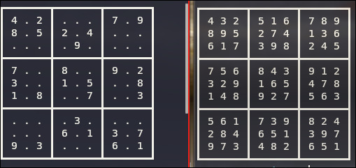

# Sudoku Solver
I wrote this project to implement a method of solving the sudoku game, using entirely the C language. To use this program is required `make` and the compiler `gcc`.  

I'm attaching a couple of screenshots:



## project composition
The project is divided into the following folders:
- `prg/` ----------| The main program is located here: ---`sudoku_solver.c`
- `lib/` ----------| The libraries are located here: --------`sudoku_lib.c`
- `head/` ---------| The header file is located here: -------`sudoku_lib.h`
- `collection/`--|
- `build/` --------| The Makefile is located here, and the compilation results will end up here.
- `doc/` -----------| Here are the files useful for the README.md.
## Project compilation
Once the files are been downloaded, you need to enter the folder `sudoku_solver/` and start the compilation with the command:  

```bash
make
```

This will create a `sudoku_solver` executable file (as well as object files in the `build/` folder). Then you have to run it from terminal with the command (on linux):

```bash
./sudoku_solver
```
---
Another available commands are:
```bash 
make clean
```
which deletes all object files from `build/`
```bash
make start
```
Which compiles and executes the program

## Usage
The `collection/` folder contains 34 puzzles by default. When you launch the program, you must enter an integer from 1 to 34; then the unsolved Sudoku will appear. If you want to solve it, simply give permission with `y` or just `ENTER`. Otherwise, to change the puzzle, type `n` and select another Sudoku.
## Data type
Puzzles are saved in `.skd` files in the `collection/` folder; are named as `puzzle(n).skd`, with `(n)` being an integer.  
The file type is structured like this:
```txt
#C Cleve Moler - Easy, no backtracking required.
207091004
000000012
600002590
805023400
970000026
001760908
086200003
730000000
500630109
```
Where everything after `#` is a comment and the `0` are the representations of the blank spaces in the sudoku puzzle.